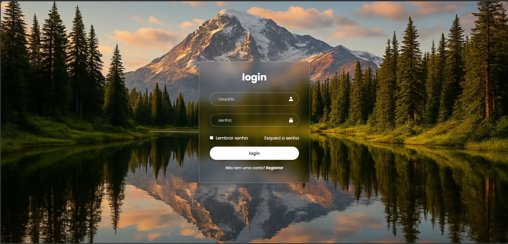

# 🔐 Página de Login

Projeto de uma página de login moderna e responsiva, desenvolvida com foco em boas práticas de HTML e CSS, além de uma interface limpa e intuitiva para o usuário.

---

## 📸 Preview



---

## 🚀 Tecnologias utilizadas

* HTML5
* CSS3
* Boxicons (ícones)
* Google Fonts

---

## ⚙️ Funcionalidades

* Campo de login (email)
* Campo de senha
* Opção "lembrar senha"
* Link "esqueci a senha"
* Link para registro de usuário
* Interface centralizada na tela

---

## 🎨 Diferenciais

* Design moderno com efeito **glassmorphism**
* Uso de `backdrop-filter` para efeito de desfoque
* Interface simples e intuitiva
* Uso de ícones para melhorar a experiência do usuário

---

## 🎯 Objetivo

Este projeto foi desenvolvido com o objetivo de praticar a criação de interfaces web modernas, utilizando HTML e CSS, com foco em responsividade e experiência do usuário (UX).

---

## 📂 Estrutura do projeto

```
/projeto-login
│── index.html
│── style.css
│── /img
│    └── img.jpg
```

---

## ▶️ Como executar

1. Baixe ou clone este repositório
2. Abra o arquivo `index.html` no navegador

---

## 📌 Melhorias futuras

* Validação de formulário com JavaScript
* Integração com backend (login real)
* Melhorias na responsividade para dispositivos móveis

---

## 👨‍💻 Autor

Desenvolvido por (Luiz almiro)
